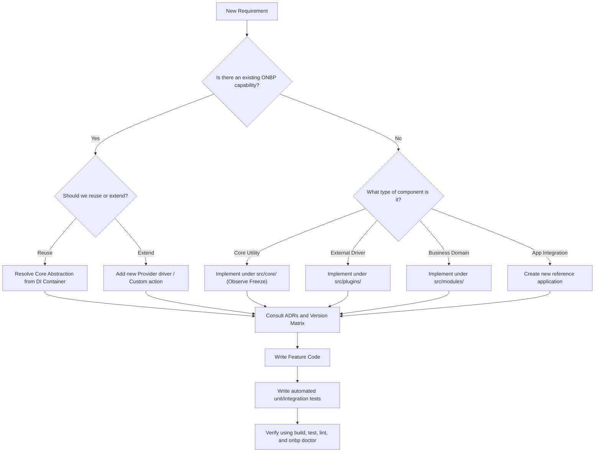

# AI Decision Tree

Use this decision tree when mapping requirements to implementation designs in ONBP.

## Mermaid Decision Tree Flowchart

---

## Guidelines for Choices

- **Use core** only for system boot, DI orchestration, configuration bindings, logging configurations, or framework doctor rules.
- **Use plugins** when wrapping direct databases, key value stores, or external API platforms (Better Auth, Redis, MinIO).
- **Use modules** for standard domain operations (Express controllers, databases tables, API routers).
- **Use providers** when mapping concrete implementations to core interfaces (e.g. SMTP for Email, LocalStorage for Storage).
- **Use workflows** when orchestrating multi-step pipelines involving multiple modules or platform services sequentially.
